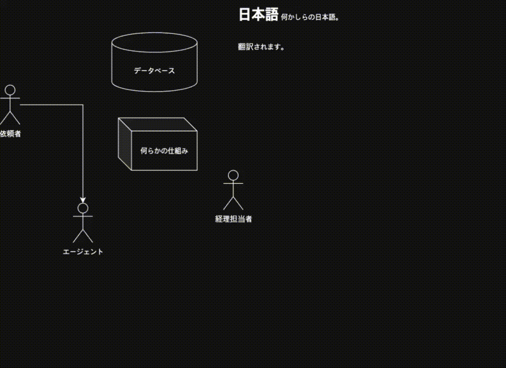

<div align="center">
  
</div>

# JaToKo (Japanese-to-Korean Translator)

**JaToKo**는 Astah 다이어그램 파일(.asta) 및 SVG 파일에 포함된 일본어 텍스트를 자동으로 추출하여 한국어로 번역해주는 웹 애플리케이션입니다.

- **Astah 파일**: 모델 요소(클래스, 속성 등)와 다이어그램 내 텍스트를 번역하여 새로운 파일로 저장합니다.
- **SVG 파일**: `<text>`, `<p>`, `<h1>` 등 foreignContext 내 텍스트를 감지하여 번역하고, 마우스 오버 시 번역문을 보여주는 기능을 추가합니다.
- **일괄 처리**: 여러 파일을 한 번에 업로드하고 번역할 수 있습니다.

## SVG 번역 결과


## Astah 번역 결과


## ✨ 주요 기능

- 📂 **다양한 파일 지원**: `.asta` (Astah Professional), `.svg` 파일 지원
- 🤖 **자동 번역**: DeepL API를 활용한 고품질 일본어 → 한국어 번역
- 📦 **배치 작업**: 다중 파일 업로드, 일괄 번역, 일괄 삭제 지원
- 🖥 **직관적인 UI**: React 기반의 드래그 앤 드롭 인터페이스 및 파일 상태(업로드됨, 번역됨) 시각화
- 🔄 **버전 관리**: 동일 파일에 대한 여러 번의 번역 결과 관리
- 📊 **실시간 진행률**: SSE(Server-Sent Events)를 통한 번역 진행 상황 실시간 표시
- 🔍 **SVG 아웃라인 감지**: 텍스트가 아웃라인화된 SVG 파일 자동 감지 및 경고

## 🛠 기술 스택

### Backend
- **Java 21**
- **Spring Boot 3.5.7**
- **Astah Professional SDK** (Astah 파일 파싱)
- **Apache Batik** (SVG 처리)
- **DeepL Java Library** (번역 API)

### Frontend
- **React 19.2.3** + **React DOM 19.2.3**
- **TypeScript 5.8**
- **Vite 6.3** (빌드 도구)
- **Zustand 5.0** (상태 관리)
- **Tailwind CSS 4.1** (스타일링)
- **Axios** (HTTP 클라이언트)
- **Day.js** (날짜/시간 포맷팅)
- **SSE (Server-Sent Events)** (실시간 진행률 표시)

### Infrastructure
- **Docker & Docker Compose**

## 🚀 시작하기

### 1. 필수 요구사항
- **Docker & Docker Compose**
- **DeepL API Key** (Free 또는 Pro)
- **Astah Professional** (SDK 라이브러리 추출용, 선택 사항이지만 권장)

### 2. 설치 및 설정

1. **저장소 클론**
   ```bash
   git clone <repository-url>
   cd jatoko
   ```

2. **환경 변수 설정**
   `.env.example` 파일을 복사하여 `.env` 파일을 생성하고 DeepL API 키를 입력합니다.
   ```bash
   cp .env.example .env
   ```
   `.env` 파일 내용:
   ```env
   DEEPL_AUTH_KEY=your_deepl_api_key_here
   # DEEPL_GLOSSARY_ID=optional_glossary_id
   ```

   **용어집(Glossary) 활용 (선택 사항)**

   프로젝트에 포함된 `glossary_for-iconnect.csv` 파일은 DeepL 용어집 형식의 일본어-한국어 번역 사전입니다. 업계 용어나 고유 표현의 번역 일관성을 높이고 싶다면, 이 파일을 본인의 DeepL 계정에 용어집으로 등록하여 사용할 수 있습니다.

   1. [DeepL 계정](https://www.deepl.com/your-account/glossaries)에 로그인
   2. 용어집 메뉴에서 CSV 파일 업로드
   3. 생성된 Glossary ID를 `.env` 파일의 `DEEPL_GLOSSARY_ID`에 설정

   용어집을 사용하면 특정 용어가 매번 동일하게 번역되어 어색한 번역을 줄일 수 있습니다.

3. **Astah SDK 라이브러리 설정**
   Astah Professional이 설치되어 있다면 자동으로 SDK 라이브러리를 설정할 수 있습니다:
   ```bash
   make setup-astah
   ```

   또는 특정 경로에서 가져오려면:
   ```bash
   make setup-astah ASTAH_PATH=/path/to/astah
   ```

   수동으로 설정하려면 `backend/libs` 디렉토리에 다음 파일들을 복사하세요:
   - `astah-api.jar`
   - `astah-professional.jar`
   - `rlm-1601.jar`
   
<details>
<summary>🔑 DeepL API 키 발급받는 방법 (클릭)</summary>

1. [DeepL API 가입 페이지](https://www.deepl.com/pro-api) 접속
2. **DeepL API Free** 요금제 선택 (월 50만 자 무료)
3. 회원가입 및 카드 등록 (Free는 실제 결제되지 않음)
4. 계정 관리 페이지에서 **'API Key'** 복사

</details>

### 3. 실행 (Docker Compose)

`Makefile`을 사용하여 간편하게 실행할 수 있습니다.

```bash
# 서비스 시작 (백엔드 + 프론트엔드)
make up

# 서비스 종료
make down

# 로그 확인
make logs
```

실행 후 브라우저 접속:
- **Frontend**: [http://localhost:3000](http://localhost:3000)
- **Backend API**: [http://localhost:8080](http://localhost:8080)

### 4. 로컬 개발 실행

**Backend**
```bash
cd backend
./gradlew bootRun
```

**Frontend**
```bash
cd frontend
npm install
npm run dev
```

### 5. 테스트 파일

프로젝트 루트에 번역 기능을 테스트할 수 있는 샘플 파일들이 포함되어 있습니다:

| 파일 | 설명 |
|------|------|
| `test.asta` | Astah Professional 다이어그램 샘플 (일본어 클래스/속성 포함) |
| `test.svg` | SVG 텍스트 요소 샘플 |
| `UseCase.svg` | 유스케이스 다이어그램 SVG 샘플 |

애플리케이션 실행 후 테스트 파일들을 업로드하여 번역 기능을 테스트할 수 있습니다.

## 📡 API 명세

파일 관리를 위한 통합 컨트롤러(`DirectoryController`)를 사용합니다.

### 주요 엔드포인트

| Method | Endpoint | 설명 |
|--------|----------|------|
| `GET` | `/api/files/metadata` | 전체 파일 목록 및 상태(번역 여부, 버전, 아웃라인 여부 등) 조회 |
| `GET` | `/api/files/{type}` | 지정된 디렉토리(`target` 또는 `translated`)의 파일 목록 조회 |
| `POST` | `/api/files/target` | 파일 업로드 (Multipart) - 아웃라인 여부도 함께 반환 |
| `POST` | `/api/translate-file` | 단일 파일 번역 요청 (Body: `{"fileName": "...", "clientId": "..."}`) |
| `POST` | `/api/translate/batch` | 다중 파일 일괄 번역 요청 (Body: `{"fileNames": ["...", "..."]}`) |
| `GET` | `/api/download/translated/{targetFileName}` | target 파일명에 대응하는 최신 번역 파일 다운로드 |
| `GET` | `/api/files/translated/{fileName}` | 특정 번역 파일 다운로드 |
| `DELETE` | `/api/files/{type}/{fileName}` | 파일 삭제 (target 타입 삭제 시 번역 파일 및 메타데이터도 함께 삭제) |
| `POST` | `/api/files/batch-delete` | 다중 파일 일괄 삭제 (Body: `{"fileNames": ["...", "..."]}`) |
| `GET` | `/api/progress/subscribe/{clientId}` | SSE: 번역 진행률 실시간 구독 (EventSource 사용) |

## 📂 프로젝트 구조

```
jatoko/
├── backend/                           # Spring Boot Application (Java 21)
│   ├── src/main/java/com/jatoko/
│   │   ├── controller/                # REST API 컨트롤러
│   │   │   └── DirectoryController    # 파일 관리 및 번역 API 진입점
│   │   ├── service/                   # 비즈니스 로직
│   │   │   ├── DirectoryService       # 파일 관리 통합 서비스
│   │   │   ├── ProgressService        # SSE 진행률 관리
│   │   │   ├── MetadataService        # 파일 메타데이터 관리
│   │   │   ├── BaseParserService      # 공통 파싱 로직 (추상 클래스)
│   │   │   ├── AstahParserService     # Astah 파일 파싱 및 번역
│   │   │   ├── SvgParserService       # SVG 파일 파싱 및 번역
│   │   │   ├── extractor/             # 텍스트 추출 로직
│   │   │   │   ├── NodeExtractor      # Astah 모델 재귀 탐색 및 추출
│   │   │   │   ├── DiagramExtractor   # 다이어그램별 추출 전략
│   │   │   │   └── SvgTextExtractor   # SVG 텍스트 노드 추출
│   │   │   ├── translator/            # 번역 엔진
│   │   │   │   ├── Translator         # DeepL API 통합
│   │   │   │   └── TranslationMapBuilder # 번역 매핑 최적화
│   │   │   ├── applier/               # 번역 적용 로직
│   │   │   │   ├── ModelTranslationApplier    # Astah 모델 요소 번역 적용
│   │   │   │   ├── DiagramTranslationApplier  # Astah 다이어그램 번역 적용
│   │   │   │   └── SvgTranslationApplier      # SVG DOM 번역 적용
│   │   │   └── svg/                   # SVG 처리 유틸
│   │   │       ├── SvgDocumentLoader  # SVG DOM 파싱 및 저장
│   │   │       └── SvgStyleManager    # SVG 스타일 관리
│   │   ├── dto/                       # 데이터 전송 객체
│   │   ├── model/                     # 도메인 모델
│   │   ├── config/                    # 설정 클래스
│   │   ├── util/                      # 유틸리티 클래스
│   │   │   ├── JapaneseDetector       # 일본어 텍스트 감지
│   │   │   ├── KoreanDetector         # 한국어 텍스트 감지
│   │   │   └── SvgOutlineDetector     # SVG 아웃라인 감지
│   │   └── exception/                 # 예외 처리
│   └── libs/                          # Astah SDK jar 파일
│       ├── astah-api.jar
│       ├── astah-professional.jar
│       └── rlm-1601.jar
├── frontend/                          # React Application
│   ├── src/
│   │   ├── components/                # UI 컴포넌트
│   │   │   ├── FileListPanel.tsx      # 파일 관리 메인 패널
│   │   │   └── FileList/              # 파일 목록 하위 컴포넌트
│   │   ├── stores/                    # Zustand 상태 관리
│   │   │   └── translationStore.ts    # 번역 작업 상태 관리
│   │   ├── services/                  # API 통신 및 비즈니스 로직
│   │   │   └── api.ts                 # Axios 기반 API 클라이언트
│   │   └── hooks/                     # 커스텀 React Hooks
│   │       └── useFileManagement.ts   # 파일 관리 로직
│   └── package.json
├── target/                            # 업로드된 원본 파일 저장소
├── translated/                        # 번역된 파일 저장소
├── docker-compose.yml                 # Docker 컨테이너 오케스트레이션
├── Makefile                           # 빌드 및 실행 명령어 단축키
├── .env.example                       # 환경 변수 템플릿
├── CLAUDE.md                          # AI 코딩 가이드
└── LICENSE                            # AGPL-3.0 라이선스
```

## 📝 라이선스

이 프로젝트는 **GNU Affero General Public License v3.0 (AGPL-3.0)** 하에 배포됩니다. 자세한 내용은 [LICENSE](LICENSE) 파일을 참조하십시오.

> **주의**: 이 프로젝트는 **Astah Professional SDK**를 사용합니다. Astah SDK 및 관련 라이브러리의 저작권 및 라이선스 정책은 해당 저작권자(Change Vision, Inc.)에게 있으며, 이를 준수해야 합니다.
